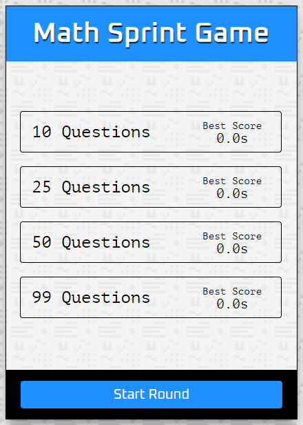

# Math Sprint Game

Welcome to the Math Sprint Game! This web-based game challenges your mathematical skills by presenting you with a series of equations that you need to solve as quickly as possible. This repository contains the HTML, CSS, and JavaScript code for the game.



## Table of Contents

- [Features](#features)
- [Demo](#demo)
- [How to Play](#how-to-play)
- [Installation](#installation)
- [Technologies Used](#technologies-used)


## Features

- Choose the number of math questions to answer (10, 25, 50, or 99).
- Solve equations as quickly as possible by selecting whether they are correct or incorrect.
- Track your best scores for each question amount.
- Play again and try to beat your previous records.
- Responsive design for various screen sizes.

## Demo

You can play the Math Sprint Game [here](https://math-sprint-game-js.netlify.app).

## How to Play

1. Start the game by selecting the number of questions you want to answer (10, 25, 50, or 99) on the splash page.
2. Click the "Start Round" button.
3. The game will begin with a countdown (3...2...1...GO!).
4. Solve each equation presented to you by clicking "Right" if it's correct or "Wrong" if it's incorrect.
5. The game will keep track of your time and apply penalties for incorrect answers.
6. After completing all the questions, your final time and scores will be displayed.
7. You can choose to play again and try to improve your score.

## Installation

To run this project locally, follow these steps:

1. Clone the repository to your local machine:

   ```bash
   git clone https://github.com/SyedAbdullah01/math-sprint-game.git
  1. Navigate to the project directory
     cd math-sprint-game
  2. Open the `index.html` file in your web browser.


## Technologies Used

The Math Sprint Game was built using the following technologies and tools:

- **HTML**: Used for creating the structure of the web pages.
- **CSS**: Employed for styling and layout design to make the game visually appealing.
- **JavaScript**: Utilized for implementing the game logic, user interactions, and timer functionality.
- **GitHub**: The codebase is hosted and shared on GitHub.
- **Netlify**: Deployed the live demo of the Math Sprint Game.
